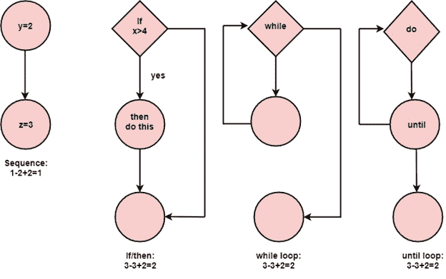

# 圈复杂度

> 原文：<https://www.javatpoint.com/software-engineering-cyclomatic-complexity>

圈复杂度是一种用来衡量程序复杂度的软件度量。托马斯·麦凯布在 1976 年提出了这一指标。麦凯布将计算机程序解释为一组强连通有向图。节点表示源代码中没有分支的部分，弧线表示程序执行期间可能的控制流传输。程序图的概念已经被用于这种测量，并且它被用于测量和控制通过程序的路径数量。计算机程序的复杂性可以与图的拓扑复杂性相关联。

## 如何计算圈复杂度？

McCabe 提出了图论中的圈数 V (G)作为软件复杂度的指标。圈数等于程序在其图形表示中的线性独立路径数。对于程序控制图，圈数 V (G)如下:

V (G) = E - N + 2 * P

E =图 G 中的边数

N =图 G 中的节点数

P =图 g 中连通分量的个数。

### 示例:

## 圈复杂度的属性:

以下是圈复杂度的属性:

1.  V (G)是图中独立路径的最大数量
2.  V (G) >=1
3.  如果 V (G) = 1，G 将有一条路径
4.  将复杂性降至 10

* * *