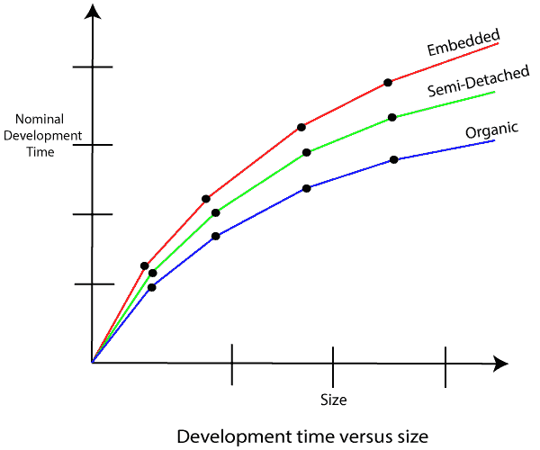
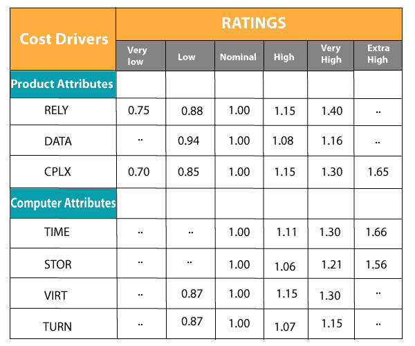
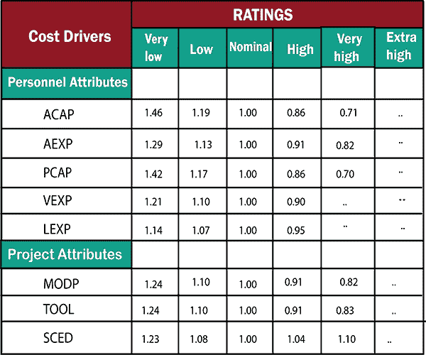

# COCOMO 模型

> 原文：<https://www.javatpoint.com/cocomo-model>

Boehm 在 1981 年提出了建设成本估算模型。COCOMO 是世界上最常用的软件评估模型之一。COCOMO 根据软件的大小预测软件产品的工作量和进度。

**该模型的必要步骤为:**

1.  从评估数千行交付的源代码(KDLOC)中获得开发工作的初步估计。
2.  从项目的各种属性中确定一组 15 个乘数。
3.  通过将初始估计值乘以所有乘法因子来计算工作量估计值，即乘以步骤 1 和步骤 2 中的值。

初始估计(也称为名义估计)由静态单变量模型中使用的形式方程确定，使用 KDLOC 作为大小的度量。为了确定人月中的初始努力 E i ，所使用的公式如下所示

**E i =a*(KDLOC)b**

常数 a 和 b 的值取决于项目类型。

**在 COCOMO 中，项目分为三种类型:**

1.  有机的
2.  双拼式的
3.  植入的

**1。有机:**一个开发项目可以被视为有机类型，如果这个项目处理的是开发一个很好理解的应用程序，那么开发团队的规模是合理的小，并且团队成员在开发类似方法的项目方面是有经验的。**这类项目的例子有简单的业务系统、简单的库存管理系统和数据处理系统。**

**2。半独立的:**如果开发项目由经验丰富和缺乏经验的人员组成，则可以用半独立的类型来处理开发项目。团队成员可能在相关系统方面经验有限，但可能不熟悉正在开发的订单的某些方面。**半分离系统的例子包括开发新的操作系统、数据库管理系统和复杂的库存管理系统。**

**3。嵌入式:**如果正在开发的软件与复杂的硬件强耦合，或者如果存在对操作方法的严格规定，则开发项目被视为嵌入式。**例如:** ATM，空中交通管制。

对于三个产品类别，Bohem 提供了一组不同的表达式，用于根据 KLOC(千行代码)中的估计大小来预测工作量(以人月为单位)和开发时间。工作量估计考虑了由于假期、每周休息、咖啡休息等造成的生产率损失。

Boehm 认为，软件成本估算应通过三个阶段完成:

1.  基本模型
2.  中间模型
3.  详细模型

**1。基本 COCOMO 模型:**基本 COCOMO 模型提供了项目参数的精确大小。以下表达式给出了基本的 COCOMO 估计模型:

**努力= a1*(KLOC)a2PM**T6**Tdev = b1*(努力)b 2 月**

在哪里

**KLOC** 是以千行代码表示的软件产品的估计大小，

a 1 ，a 2 ，b 1 ，b 2 是每组软件产品的常数，

**Tdev** 是软件开发的预计时间，以月表示，

**工作量**是开发软件产品所需的总工作量，以**人月**表示。

**开发工作的评估**

对于三类软件产品，基于代码大小估算工作量的公式如下所示:

**有机:**努力= 2.4(KLOC)下午 1.05

**半分离:**努力= 3.0(KLOC)下午 1.12

**嵌入:**努力= 3.6(KLOC)下午 1.20

**开发时间估算**

对于三类软件产品，基于工作量估算开发时间的公式如下:

**有机:** Tdev = 2.5(努力)0.38 个月

**半分离:** Tdev = 2.5(努力)0.35 个月

**嵌入:** Tdev = 2.5(努力)0.32 个月

对基本 COCOMO 模型的一些洞察可以通过绘制不同软件规模的估计特征来获得。图显示了估计工作量与产品规模的关系图。从图中，我们可以观察到，在软件产品的规模上，这种努力有些超线性。因此，开发产品所需的工作量随着项目规模的增加而迅速增加。

在 KLOC 中，开发时间与产品尺寸的关系绘制在图中。从图中可以观察到，开发时间是产品尺寸的次线性函数，即当产品尺寸增加两倍时，开发产品的时间不会增加一倍，而是适度增加。这可以用以下事实来解释:对于较大的产品，可以确定可以同时进行的大量活动。工程师可以同时进行并行活动。这减少了完成项目的时间。此外，从图中可以观察到，所有三类产品的开发时间大致相同。例如，60 KLOC 程序可以在大约 18 个月内开发出来，无论它是有机的、半分离的还是嵌入式的。

根据工作量估算，项目成本可以通过每月所需工作量乘以人力成本来获得。但是，在这个项目成本计算中隐含着这样一个假设，即整个项目成本仅仅是由人力成本引起的。除了人力成本之外，由于项目所需的硬件和软件以及公司在管理、办公空间等方面的管理费用，项目还会产生成本。

需要注意的是，使用 COCOMO 模型获得的努力和持续时间估计被称为名义努力估计和名义持续时间估计。术语“名义上”意味着，如果有人试图在短于预计工期的时间内完成项目，那么成本将大幅增加。但是，如果任何人完成项目的时间比估计的时间长，那么估计的成本价值几乎没有减少。

**示例 1:** 假设一个项目估计为 400 KLOC。计算三种模型(即有机的、半分离的&嵌入式)的工作量和开发时间。

**解:**基本 COCOMO 方程的形式为:

努力= a1*(KLOC)a2PM
Tdev = b1*(努力)b 2 月
项目预计规模= 400 KLOC

**(一)有机模式**

e = 2.4 *(400)1.05 = 1295.31PM
D = 2.5 *(1295.31)0.38 = 38.07PM

**(二)半分离模式**

e = 3.0 *(400)1.12 = 2462.79PM
D = 2.5 *(2462.79)0.35 = 38.45PM

**(三)嵌入式模式**

e = 3.6 *(400)1.20 = 4772.81PM
D = 2.5 *(4772.8)0.32 = 38PM

**示例 2:** 将开发一个 200 KLOC 的项目规模。软件开发团队在类似类型的项目上有一般的经验。项目进度不是很紧。计算项目的工作量、开发时间、平均员工规模和生产率。

**解决方案:**考虑到开发时间的大小、进度和体验，半解析模式是最合适的模式。

因此 E = 3.0(200)1.12 = 1133.12pm
D = 2.5(1133.12)0.35 = 29.3pm

P = 176 LOC/PM

**2。中间模型:**基本的 Cocomo 模型认为，付出的努力只是代码行数和根据各种软件系统计算的一些常数的函数。中间 COCOMO 模型认识到这些事实，并根据软件工程的各种属性，通过使用一组 15 个成本驱动因素，细化通过基本 COCOMO 模型获得的初始估计。

**成本动因分类及其属性:**

**(一)产品属性-**

*   所需的软件可靠性范围
*   应用程序数据库的大小
*   产品的复杂性

**硬件属性-**

*   运行时性能限制
*   内存限制
*   虚拟机环境的不稳定性
*   所需周转时间

**人员属性-**

*   分析师能力
*   软件工程能力
*   应用体验
*   虚拟机体验
*   编程语言经验

**项目属性-**

*   软件工具的使用
*   软件工程方法的应用
*   所需的开发时间表

**成本动因分为四类:**

**中间 COCOMO 方程:**

**E = aI(KLOC)bI* EAF**
**D = cI(E)DI**

中间 COCOMO 的系数

| 项目 | a i | b i | c i | d i |
| 有机的 | Two point four | One point zero five | Two point five | Zero point three eight |
| 双拼式的 | Three | One point one two | Two point five | Zero point three five |
| 植入的 | Three point six | One point two | Two point five | Zero point three two |

**3。详细 COCOMO 模型:**详细 COCOMO 将标准版本的所有品质与成本动因的评估结合在一起？对软件工程过程中每种方法的影响。详细模型对每个成本动因属性使用不同的努力乘数。在详细的 cocomo 中，整个软件被区分为多个模块，然后我们在各个模块中应用 COCOMO 来估计工作量，然后对工作量进行求和。

详细 COCOMO 的六个阶段是:

1.  规划和要求
2.  系统结构
3.  完整结构
4.  模块代码和测试
5.  集成和测试
6.  成本构成模型

工作量被确定为程序估计的函数，并且根据软件生命周期的每个阶段给出一组成本驱动因素。

* * *