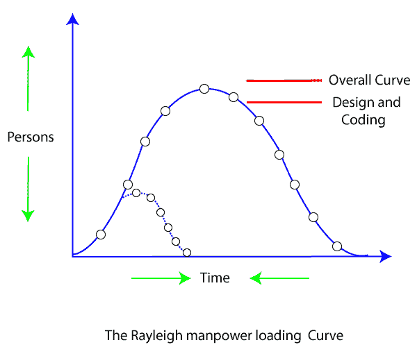
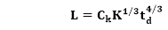
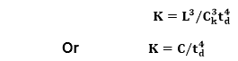
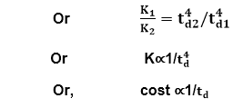

# 普特南资源分配模型

> 原文：<https://www.javatpoint.com/putnam-resource-allocation-model>

劳伦斯·普特南模型描述了完成一个特定规模的软件项目所需的时间和精力。普特南利用所谓的诺顿/瑞利曲线来估算项目工作量、进度和缺陷率，如图 1 所示:

普特南注意到软件人员配置遵循众所周知的瑞利分布。普特南利用他对生产力水平的观察推导出软件方程式:

**该表达式的各种术语如下:**

**K** 为产品开发所花费的总精力(PM)，L 为 **KLOC** 中的产品估算。

**tdT3】与系统和集成测试的时间相关。因此， **t d** 可以相对认为是开发产品所需的时间。**

**C k** 是技术状态不变，反映了阻碍程序发展的需求。

开发环境差时 **C k** 的典型值= 2

**C k** = 8 为良好的软件开发环境

**C k** = 11 对于一个优秀的环境(除了遵循软件工程原则，还使用自动化工具和技术)。

特定任务的 **C k** 的精确值可以从开发它的组织的历史数据中计算出来。

普特南提出，在一个项目上开发的最佳员工应该遵循瑞利曲线。在计划开始时，只需要少数工程师来执行计划和规范任务。随着项目的进展和更详细的工作是必要的，工程师的数量达到顶峰。在实施和单元测试之后，项目人员的数量下降了。

## 计划变更对成本的影响

**普特南推导出以下表达式:**

其中， **K** 是产品开发中花费的总精力(PM)

**L** 为 KLOC 中的产品尺寸

**t d** 对应系统和集成测试的时间

**C k** 技术状态是否不变，是否反映了阻碍项目进展的约束

现在通过使用上面的表达式，可以得到，

对于相同的产品尺寸，C = L3/Ck3为常数。

(因为项目开发工作与项目开发成本成正比)

从上面的表达式可以很容易地观察到，当一个项目的进度被压缩时，所需的开发工作量以及项目开发成本与压缩程度的四次方成比例地增加。这意味着交付时间表中相对较小的压缩会导致人力和开发成本的巨大损失。

**例如，**如果预计开发时间为 1 年，那么要在 6 个月内开发产品，开发产品所需的总工作量(以及因此产生的项目成本)将增加 16 倍。

* * *