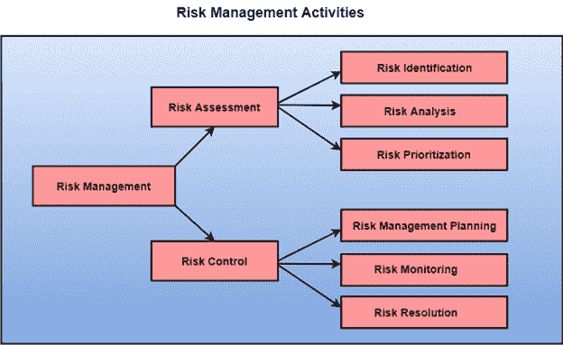

# 风险管理活动

> 原文：<https://www.javatpoint.com/software-engineering-risk-management-activities>

**风险管理由三个主要活动组成，如图:**

## 风险评估

风险评估的目的是在造成潜在损失的情况下划分风险。对于风险评估，首先，应该用两种方法对每个风险进行评级:

*   风险成真的可能性(表示为 r)。
*   这些问题的后果与该风险有关(标记为 s)。

基于这两种方法，可以估计每个风险的优先级:

p = r * s

其中 p 是必须控制风险的优先级，r 是风险变为真实的概率，s 是由于风险变为真实而造成损失的严重程度。如果所有确定的风险都成立，那么最有可能和破坏性的风险可以首先得到控制，并且可以针对这些风险设计更全面的风险消减方法。

**1。风险识别:**项目组织者需要尽早预见项目中的风险，以便通过制定有效的风险管理规划来降低风险的影响。

一个项目可能会有各种各样的风险。为了识别重大风险，这可能会影响项目。有必要将类别划分为不同的风险类别。

有不同类型的风险会影响软件项目:

1.  **技术风险:**从用于开发系统的软件或硬件技术中承担的风险。
2.  **人员风险:**与开发团队中的人员相关的风险。
3.  **组织风险:**从开发软件的组织环境中承担的风险。
4.  **工具风险:**从用于创建系统的软件工具和其他支持软件中承担的风险。
5.  **需求风险:**从客户需求变化和管理需求变化的过程中承担的风险。
6.  **估计风险:**根据管理层对构建系统所需资源的估计而承担的风险

**2。风险分析:**在风险分析过程中，您必须考虑每个已识别的风险，并对该风险的概率和严重性做出感知。

没有简单的方法可以做到这一点。你必须依靠你对以前的项目和项目中出现的问题的感知和经验。

不可能对每个风险的概率和严重性做出精确的数字估计。相反，您应该将风险授权给以下几个级别之一:

1.  风险的概率可以确定为非常低(0-10%)、低(10-25%)、中等(25-50%)、高(50-75%)或非常高(+75%)。
2.  风险的影响可能被确定为灾难性的(威胁计划的生存)、严重的(会导致重大延误)、可容忍的(延误在允许的应急范围内)或微不足道的。

## 风险控制

它是管理风险以达到预期结果的过程。毕竟，计划的识别风险是确定的；项目必须包含最有害和最有可能的风险。不同的风险需要不同的遏制方法。事实上，大多数风险需要项目经理在处理风险时的独创性。

**计划风险管理主要有三种方法:**

1.  **规避风险:**这可能采取多种方式，如与客户讨论变更要求以缩小工作范围、对工程师进行激励以规避人力资源流失风险等。
2.  **转移风险:**该方法涉及获取第三方开发的风险要素、购买保险等。
3.  **风险降低:**这意味着计划方法要包括风险造成的损失。例如，如果有一些关键人员可能离开的风险，可以计划新的招聘。

**风险杠杆:**在处理风险的各种方法之间进行选择，项目计划必须考虑控制风险的金额和相应的降低风险。为此，可以估算各种风险的风险杠杆。

风险杠杆是风险暴露的变化除以降低风险的数量。

**风险杠杆=(减持前风险敞口-减持后风险敞口)/(减持成本)**

**1。风险规划:**风险规划方法考虑已识别的每个关键风险，并制定维护这些风险的方法。

对于每种风险，您必须考虑如果风险中确定的问题发生，您可能采取的行为，以最大限度地减少对计划的干扰。

您还应该考虑在监控计划时可能需要收集的数据，以便可以预测问题。

同样，应急计划也没有简单的流程可以遵循。它依赖于项目经理的判断和经验。

**2。风险监控:**风险监控是你对产品、流程和业务风险的假设没有改变的方法王。

* * *