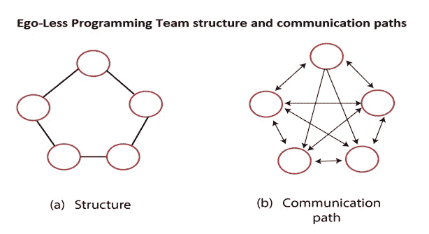
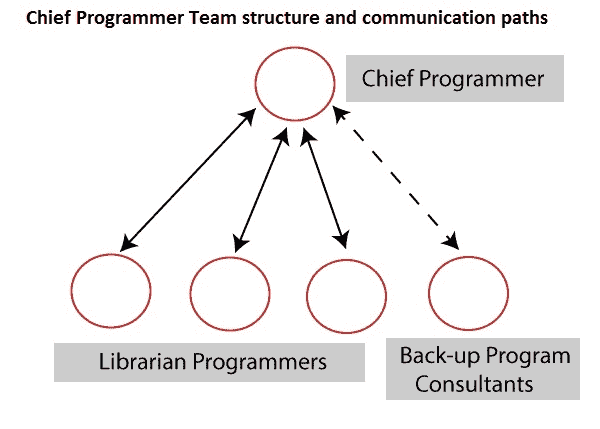
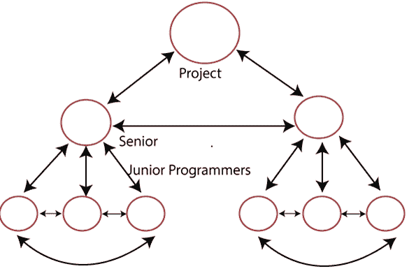

# 人事规划

> 原文：<https://www.javatpoint.com/software-engineering-personnel-planning>

人事规划涉及人员配备。人员配置是指为组织结构确定的职位任命人员。

它包括:

*   定义对人员的要求
*   招聘(确定、面试和选择候选人)
*   修正
*   开发和推广代理

对于人员计划和调度，系统中子系统和必要组件的工作量和调度规模是有帮助的。

在计划的时候，当系统方法还没有完成的时候，计划者只能思考去了解系统中的大型子系统，可能还有这些子系统中的主要模块。

一旦估计了项目计划，并且知道了各个阶段和功能的工作和进度，就可以实现人员需求。

从项目的成本和总持续时间来看，项目的平均人员规模可以通过将总工作量(以人-月为单位)除以整个项目持续时间(以月为单位)来确定。

通常，项目所需的人员在需求和设计阶段很少，在实现和测试阶段最多，在集成和测试的最后阶段又会减少。

使用 COCOMO 模型，当每种方法的工作量和进度已知时，可以计算出各个阶段的平均人员需求。

当每个行动的时间表和平均人员水平都很清楚时，就可以计划项目的整体人员分配。

该计划将表明在项目持续期间，不同时间的不同活动需要多少人。

每个月的总工作量和每个步骤的总工作量可以很容易地从这个计划中计算出来。

## 团队结构

团队结构解决了单个项目团队的安排问题。有一些可能的方法可以组织不同的项目团队。主要有三种正式的团队结构:**首席程序员，无自我或民主，混合团队组织**甚至这些结构的其他几种变体也是可能的。各种复杂和规模的问题通常需要不同的团队结构来解决。

## 无我或民主团队

没有自我的团队由更少的程序员组成。该小组的目标是通过协商一致确定的，每个成员的意见都会被用于重大决策。团队领导围绕着团队成员。由于其本质，无自我团队一直被称为民主团队。

该结构允许来自所有代表的输入，这可以在各种问题中导致更好的决策。这表明这种方法非常适合没有时间限制的长期研究型项目。

## 主编程组

与没有自我的团队相反，首席程序员团队有一个等级制度。它由一名首席程序员、一名后备程序员、一名程序管理员和一些程序员组成。

首席程序员对于项目的所有主要技术决策都是必不可少的。

他做大部分的设计，他把设计不同部分的编码分配给程序员。

后备程序员使用首席程序员进行技术决策，如果首席程序员生病或离开，则接替首席程序员。

项目管理员对于维护文档和其他与沟通相关的工作至关重要。

这种结构大大减少了人际交往。通信路径，如图:

## 受控分散团队

### (分层团队结构)

第三个团队结构被称为受控分散团队，试图结合民主团队和首席程序员团队的力量。

它由项目负责人组成，项目负责人手下有一班高级程序员，而每个高级程序员手下都是一群初级程序员。

一个高级程序员和他的初级程序员组成的团队表现得像一个没有自我的团队，但是不同团队之间的交流只能通过该团队的高级程序员来进行。

高级程序员还与项目负责人沟通。

这样的团队比民主团队有更少的沟通途径，但比首席程序员团队有更多的途径。

这种结构最适合相当简单的大型项目。它不太适合简单的项目或研究型项目。

* * *