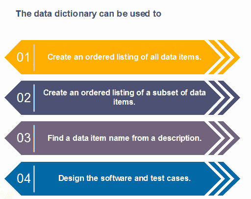

# 数据字典

> 原文：<https://www.javatpoint.com/software-engineering-data-dictionaries>

数据字典是包含数据库元数据的一个文件或一组文件。数据字典保存关于数据库中其他对象的记录，例如数据所有权、与其他对象的数据关系以及其他数据。数据字典是任何关系数据库的重要组成部分。讽刺的是，由于它的重要性，它对大多数数据库用户来说是不可见的。通常，只有数据库管理员与数据字典交互。

数据字典通常包括以下信息:

*   数据项的名称
*   别名
*   描述/目的
*   相关数据项
*   数值范围
*   数据结构定义/表单

数据项的**名称不言自明。**

**别名**包括其他名称，该数据项被称为数据输入操作员的 DEO 和副书记官长的 DR。

**描述/目的**是对数据项的用途或存在原因的文字描述。

**相关数据项**捕捉数据项之间的关系，例如 total_marks 必须始终等于 internal_marks 加上 external_marks。

**值范围**记录所有可能的值，例如总分必须为正，介于 0 到 100 之间。

**数据结构形式:**数据流捕获生成或接收数据项的进程的名称。如果数据项是原始的，那么数据结构表单捕获数据项的物理结构。如果数据本身是一个数据集合，那么数据结构表单就根据其他数据项捕获数据项的组成。

**数据字典中使用的数学运算符定义如下表:**

| 记号 | 意义 |
| x=a+b | x 包括数据元素 a 和 b。 |
| x=[a/b] | x 包括数据元素 a 或 b。 |
| x = ax | 包括最佳数据元素 a |
| x=y[a] | x 包括数据元素 a 的 y 次或更多次出现 |
| x=[a]z | x 包括 z 个或更少的数据元素 a |
| x=y[a]z | x 包括一些出现在 y 和 z 之间的数据元素 a。 |

* * *