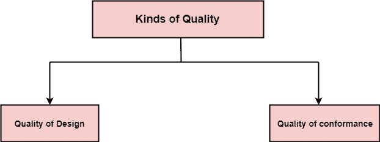

# 软件质量保证

> 原文：<https://www.javatpoint.com/software-quality-assurance>

## 什么是质量？

质量定义了任何可测量的特征，如正确性、可维护性、可移植性、可测试性、可用性、可靠性、效率、完整性、可重用性和互操作性。

**质量有两种:**

**设计质量:**设计质量是指设计者为一个项目规定的特性。材料等级、公差和性能规格都有助于设计质量。

**符合性质量:**符合性质量是在制造过程中遵循设计规范的程度。一致性程度越高，一致性质量水平越高。

**软件质量:**软件质量被定义为符合明确陈述的功能和性能要求，明确记录的开发标准，以及所有专业开发软件的固有特征。

**质量控制:**质量控制包括在整个软件过程中使用的一系列检查、评审和测试，以确保每个工作产品满足对其提出的要求。质量控制包括对创建工作产品的过程的反馈循环。

**质量保证:**质量保证是一套预防性活动，为项目成功完成提供更大的信心。

**质量保证**关注工程和管理活动将如何进行？

因为任何人都对最终产品的质量感兴趣，所以应该确保我们正在构建正确的产品。

只有当我们对中间产品进行检查和评审时，才能保证，如果有任何错误，那么就要进行调试。这种质量可以提高。

## 质量的重要性

我们希望质量是所有商品和服务生产者关心的问题。然而，软件的显著特征，特别是它的无形性和复杂性，提出了特殊的要求。

**增加软件的关键程度:**最终客户或用户自然关心软件的总体质量，尤其是可靠性。随着组织越来越依赖其计算机系统，软件在安全关键领域的使用越来越多，这种情况越来越多。例如，控制飞机。

**软件的无形性:**这使得知道项目中的某个特定任务已经圆满完成变得很有挑战性。这些任务的结果可以通过要求开发人员生产可以检查质量的“可交付成果”来具体化。

**软件开发过程中积累的错误:**由于计算机系统开发是由几个步骤组成的，从一个级别的输出被输入到下一个级别，那么早期的错误呢？可交付成果？将被添加到那些导致累积的可确定效果的后期阶段。一般来说，项目中发现错误的时间越晚，修复错误的成本就越高。此外，由于系统中的错误数量未知，项目的调试阶段特别难以控制。

## 软件质量保证

软件质量保证是所有必要措施的计划和系统计划，以提供一个项目或产品符合既定技术要求的充分信心。

设计用于计算产品开发或制造过程的一组活动。

## SQA 包含

*   质量管理方法
*   有效的软件工程技术(方法和工具)
*   在整个软件过程中测试的正式技术评审
*   多层测试策略
*   控制软件文档和对其所做的更改。
*   确保符合软件开发标准的程序
*   衡量和报告机制。

## SQA 活动

软件质量保证由与两个不同群体相关的各种功能组成？从事技术工作的软件工程师和负责质量保证计划、记录保存、分析和报告的 SQA 小组。

**以下活动由独立的 SQA 集团执行:**

1.  **为项目准备 SQA 计划:**该计划在项目规划期间制定，并由所有利益相关方审查。该计划管理由软件工程团队和 SQA 集团执行的质量保证活动。该计划确定了要执行的计算、要执行的审核和审查、适用于项目的标准、错误报告和跟踪技术、SQA 团队要生成的文档以及提供给软件项目团队的反馈量。
2.  **参与项目软件过程描述的开发:**软件团队为要执行的工作选择一个过程。SQA 小组审查过程描述是否符合组织政策、内部软件标准、外部强加的标准(例如 ISO-9001)以及软件项目计划的其他部分。
3.  **审查软件工程活动，以验证是否符合定义的软件流程:**SQA 小组识别、报告和跟踪与流程的偏差，并验证是否已经进行了纠正。
4.  **审核指定的软件工作产品，以验证其是否符合作为软件过程的一部分定义的产品:**SQA 小组审查选定的工作产品，识别、记录和跟踪偏差，验证是否进行了纠正，并定期向项目经理报告其工作结果。
5.  **确保软件工作和工作产品中的偏差被记录并根据记录的程序进行处理:**项目方法、过程描述、适用标准或技术工作产品中可能会遇到偏差。
6.  **记录任何不符合项，并向高级管理层报告:**不符合项将被跟踪，直到它们被解决。

## 质量保证质量控制

| 质量保证 | 质量管理 |
| **质量保证(QA)** 是一套行动，包括促进、培训、测量和分析，需要这些行动来提供足够的信心，即建立并持续改进流程，以生产符合规范并适合使用的产品或服务。 | **质量控制(QC)** 被描述为用于将产品质量与要求和适用标准进行比较的过程和方法，以及当检测到不符合项时采取的措施。 |
| **QA** 是建立和计算生产产品的过程的活动。如果没有过程，质量保证就没有作用。 | **QC** 是证明生产的产品是否符合标准的活动。 |
| **质量保证**帮助建立流程 | **QC** 与特定产品或服务相关 |
| **质量保证**建立一个测量程序来评估过程 | **QC** 验证明确的产品或服务中是否存在特定属性。 |
| **质量保证**识别过程中的弱点并加以改进 | **质量控制**为纠正错误的主要目标识别缺陷。 |
| 质量保证是一种管理工具。 | 质量控制是一种纠正工具。 |
| 验证是质量保证的一个例子。 | 验证是质量控制的一个例子。 |

* * *