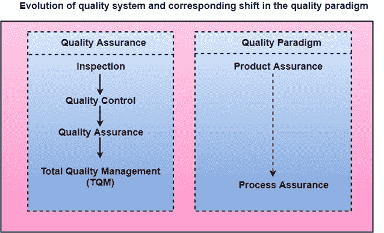

# 软件质量

> 原文：<https://www.javatpoint.com/software-engineering-software-quality>

软件质量产品是根据其适用性来定义的。也就是说，一个高质量的产品正是做了用户想要它做的事情。对于软件产品来说，使用的适宜性通常用满足 SRS 文件中规定的要求来解释。尽管对于许多设备，如汽车、台扇、磨床等，“目的适配性”是对质量的令人满意的解释，但是对于软件产品，“目的适配性”并不是对质量的完全令人满意的定义。

**示例:**考虑一个功能正确的软件产品。也就是说，它执行 SRS 文档中指定的所有任务。但是，有一个几乎无法使用的用户界面。即使它在功能上是正确的，我们也不能认为它是优质产品。

**与软件产品相关的质量的现代观点几种质量方法如下:**

**可移植性:**一个软件设备，如果可以自由地让它在各种操作系统环境下，在多台机器上，与其他软件产品一起工作等，就可以说是可移植的。

**可用性:**如果各种类别的用户都可以轻松调用产品的功能，那么软件产品的可用性就更好。

**复用性:**如果一个软件产品的不同模块能够快速复用，开发出新的产品，那么这个软件产品就具有优秀的复用性。

**正确性:**如果 SRS 文件中规定的各种要求已经正确实施，那么软件产品就是正确的。

**可维护性:**如果 bug 出现时很容易纠正，新任务很容易添加到产品中，产品的功能很容易修改等，那么软件产品就是可维护的。

## 软件质量管理系统

质量管理体系是组织用来保证他们开发的产品具有所需质量的主要方法。

**存在以下质量体系:**

**管理结构和个人责任:**质量体系是整个组织的责任。然而，每个组织都有一个独立的质量部门来执行各种质量体系活动。一项安排的质量体系应该得到最高管理层的支持。如果没有公司高层对质量体系的帮助，一些员工会认真对待质量体系。

**质量体系活动:**质量体系活动包括以下内容:

项目审计

质量体系审查

标准、方法和指南等的开发。

为最高管理层制作文件，总结组织内质量体系的有效性。

## 质量管理体系的演变

在过去的 50 年里，质量体系不断发展。第二次世界大战前，生产高质量产品的通常功能是检查成品以移除有缺陷的设备。从那时起，组织的质量体系经历了四个发展阶段，如图所示。第一个产品检验任务将方法交给了质量控制。

质量控制的目标不仅是检测有缺陷的设备并将其移除，还包括确定缺陷背后的原因。因此，质量控制旨在纠正错误的原因，而不仅仅是拒绝产品。质量方法的下一个突破是质量保证方法的发展。

现代质量保证的首要前提是，如果一个组织的过程是适当的，并得到严格遵循，那么产品就有义务具有良好的质量。新的质量职能包括识别、定义、分析和改进生产过程的指导。

全面质量管理(TQM)主张组织所遵循的程序必须通过过程测量来持续改进。全面质量管理比质量保证更进一步，旨在经常改进过程。全面质量管理不仅仅是记录步骤，而是通过重新设计来优化它们。与全面质量管理相关的一个术语是业务流程再造。

业务流程再造的目的是重新设计在一个组织中开展业务的方法。从上面的对话中，可以说这些年来，质量范式已经从产品保证转变为过程保证，如图。

* * *