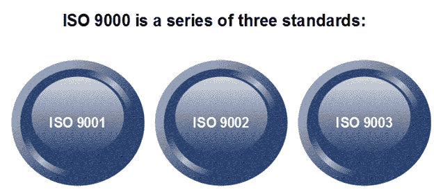
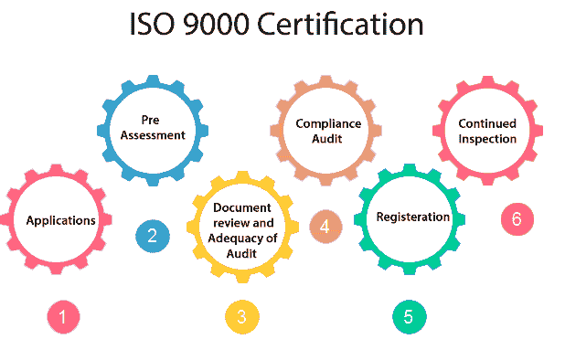

# 国际标准化组织 9000 认证

> 原文：<https://www.javatpoint.com/software-engineering-iso-9000-certification>

国际标准组织是一个由 63 个国家组成的团体或联盟，旨在规划和促进标准化。国际标准化组织在 1987 年宣布了其 9000 系列标准。作为独立当事人之间合同的参考。ISO 9000 标准确定了保持质量体系的指导方针。国际标准化组织标准主要涉及运营方法和组织方法，如责任、报告等。ISO 9000 为生产过程定义了一套准则，并不直接关注产品本身。

## 国际标准化组织 9000 质量标准的类型

ISO 9000 系列标准基于这样一个假设，即如果生产遵循一个适当的阶段，那么高质量的产品必然会自动遵循。各种国际标准化组织标准适用的行业类型如下。

1.  **ISO 9001:** 本标准适用于从事商品设计、开发、生产和服务的组织。这是适用于大多数软件开发组织的标准。
2.  **ISO 9002:** 本标准适用于不设计产品而只参与生产的组织。这些类别行业的例子包括钢铁和汽车制造行业，这些行业从外部来源购买产品和工厂设计，并且只从事制造这些产品。因此，ISO 9002 不适用于软件开发组织。
3.  **ISO 9003:** 本标准适用于仅参与产品安装和测试的组织。比如燃气公司。

## 如何获得 ISO 9000 认证？

决定获得 ISO 9000 认证的组织向国际标准化组织注册办公室申请注册。该过程包括以下阶段:

1.  **申请:**组织一旦决定走 ISO 认证，就向注册服务商申请注册。
2.  **预评估:**在此阶段，注册服务商对组织进行粗略评估。
3.  **文件审查和审核的充分性:**在此阶段，注册服务商审查组织提交的文件，并提出改进建议。
4.  **合规性审核:**在此阶段，注册服务商检查组织是否编制了其在审核期间提出的建议。
5.  **注册:**注册员在成功完成所有阶段后授予 ISO 认证。
6.  **持续检查:**注册服务商持续按时间监控组织。

* * *