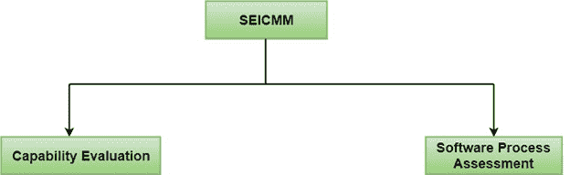
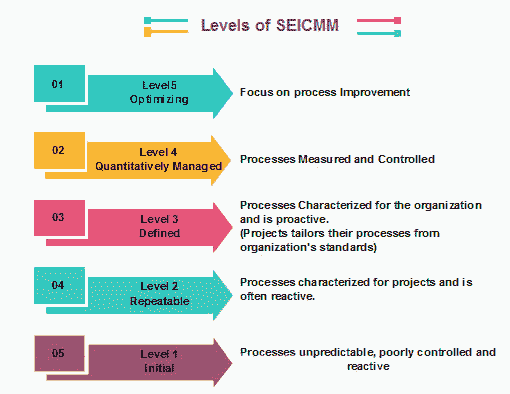
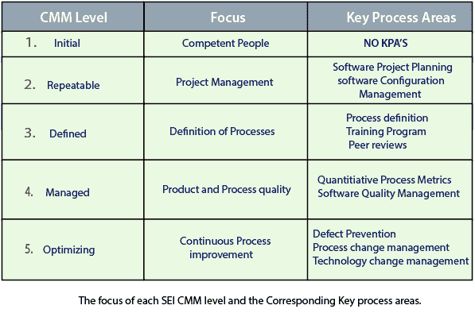

# 软件工程学院能力成熟度模型

> 原文：<https://www.javatpoint.com/software-engineering-institute-capability-maturity-model>

能力成熟度模型(CMM)是用于开发和细化组织的软件开发过程的过程。

该模型定义了一个五级进化阶段，即越来越有组织和越来越成熟的过程。

CMM 是由软件工程研究所(SEI)开发和推广的，SEI 是由美国国防部(DOD)推广的一个研发中心。

能力成熟度模型被用作衡量组织软件过程成熟度的基准。

## SEICMM 的方法

SEICMM 有两种方法:

**能力评估:**能力评估提供了一种评估组织软件过程能力的方法。能力评估的结果表明，如果承包商被授予一项工程，可能的承包商表现。因此，软件过程能力评估的结果可以用来选择承包商。

**软件过程评估:**软件过程评估被组织用来提高其过程能力。因此，这种评估纯粹是内部使用。

SEI CMM 将软件开发行业分为以下五个成熟度等级。SEI CMM 的各个层次已经被设计好，这样一个组织就很容易从零开始慢慢建立它的质量体系。

### 第 1 级:初始

在这个层次上，特定的活动是软件开发组织的特征。很少或没有过程被描述和遵循。由于软件生产过程不受限制，不同的工程师遵循他们的过程，结果，开发工作变得混乱。因此，也称之为混沌层次。

### 第 2 级:可重复

在这个层次上，建立了基本的项目管理实践，如跟踪成本和进度。规模和成本估算方法，如功能点分析、COCOMO 等。被使用。

### 级别 3:已定义

在这个层次上，管理和开发活动的方法都被定义和记录。整个组织对运营、角色和职责有共同的理解。定义的方法、过程和产品质量不被测量。达到这个水平的 ISO 9000 目标。

### 第 4 级:托管

在这个层次上，重点是软件度量。由两种度量组成。

**产品指标**衡量正在开发的产品的特征，如其规模、可靠性、时间复杂度、可理解性等。

**过程度量**跟踪正在使用的过程的有效性，例如平均缺陷纠正时间、生产率、每小时检查发现的平均缺陷数量、每次 LOC 测试期间检测到的平均故障数量等。测量软件过程和产品质量，满足产品的定量质量要求。帕累托图、鱼骨图等各种工具。用于衡量产品和过程质量。过程度量用于分析项目是否令人满意地执行。因此，过程测量的结果用于计算项目绩效，而不是改进过程。

### 第五级:优化

在这个阶段，收集过程和产品指标。对过程和产品测量数据进行评估，以实现持续的过程改进。

## 软件组织的关键过程领域

除了 SEI CMM 级别 1 之外，每个成熟度级别都由几个关键过程区域(kpa)来表征，这些区域包含了一个组织应该关注的将它的软件过程改进到下一个级别的领域。图中显示了每个级别的焦点和相应的关键流程区域。

SEI CMM 提供了一系列重点关注的关键领域，以将组织从一个成熟度级别提升到下一个成熟度级别。因此，它提供了一种在不同阶段逐步提高质量的方法。每一步都经过精心设计，每一步都能增强已经建立的能力。

* * *