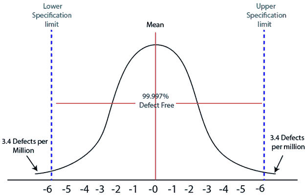
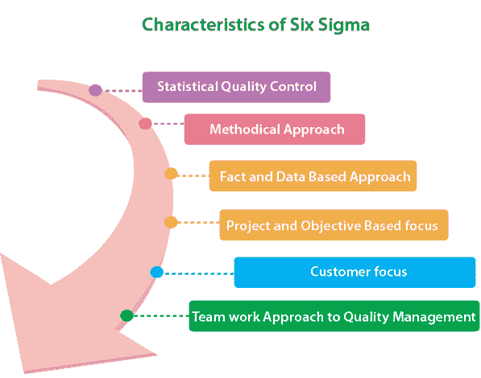
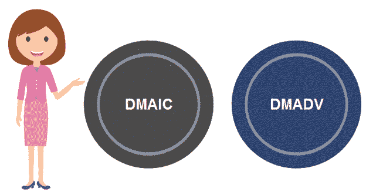
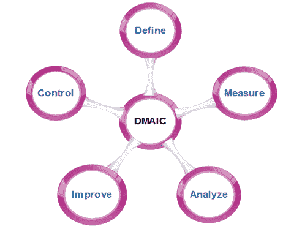
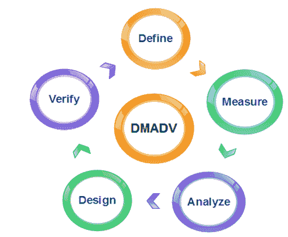

# 六西格玛

> 原文：<https://www.javatpoint.com/software-engineering-six-sigma>

六适马是通过识别和消除缺陷原因以及减少制造和业务流程中的可变性来提高输出质量的过程。制造过程的成熟度可以通过西格玛评级来定义，西格玛评级表明了制造的无缺陷产品的百分比。六西格玛方法是这样一种方法，在这种方法中，生产一个组件的某些特征的所有机会中的 **99.99966%** 在统计上预期没有缺陷(**每百万次机会中有 3.4 个缺陷特征**)。

## 六适马历史

六适马是一套过程改进的方法和工具。它是由工程师比尔·史密斯爵士在 1986 年于摩托罗拉 T2 工作时引进的。20 世纪 80 年代，**摩托罗拉**正在开发著名的类星体电视，但当时由于图像质量和声音变化，类星体电视存在许多缺陷。

通过使用相同的原材料、机器和劳动力，一个日本公司接管了类星体电视的生产，几个月之内，他们生产出了误差更小的类星体电视。这是通过改进管理技术获得的。

六适马于 1986 年被摩托罗拉首席执行官鲍勃·加尔文采用，并于 1993 年 12 月 28 日注册为摩托罗拉商标，随后成为质量领导者。

## 六个适马的特点

六适马的特点如下:

1.  **统计质量控制:**六适马来源于希腊字母σ(适马)来源于希腊字母表，用于表示统计学中的标准差。标准偏差用于测量方差，就输出质量而言，这是测量不符合的必要工具。
2.  **有条不紊的方法:**六适马理论上不仅仅是一个质量改进策略，因为它的特点是在 DMAIC 和 DMADV 应用了一个定义明确的系统方法，可以用来提高生产质量。DMAIC 是设计-测量-分析-改进-控制的缩写。替代方法 DMADV 代表设计-测量-分析-设计-验证。
3.  **基于事实和数据的方法:**六适马的统计和方法方面显示了该技术的科学基础。这突出了六适马的基本要素，这是一个事实和数据基础。
4.  **基于项目和目标的焦点:**六适马流程是针对组织的项目实施的，该项目是根据其规范和要求定制的。该过程被弯曲以适应项目运行的要求和条件，从而获得最佳结果。
5.  **客户关注:**客户关注是六适马方法的基础。质量改进和控制标准基于特定的客户要求。
6.  **质量管理的团队合作方法:**六适马流程要求组织在控制和改进质量时组织起来。根据个人在质量管理团队中的角色，六适马涉及大量培训。

## 六种适马方法

六个适马项目遵循两种项目方法:

1.  六西格玛改进
2.  断续器

### 六西格玛改进

它指定了一个数据驱动的质量策略来改进流程。这种方法用于增强现有的业务流程。

**DMAIC 项目方法有五个阶段:**

1.  **定义:**涵盖流程图和流程图、项目章程开发、问题解决工具，以及所谓的 7-M 工具。
2.  **测量:**包括测量原理、连续和离散数据、测量范围、连续和离散数据的变化原理和重复性和再现性(RR)研究概述。
3.  **分析:**涵盖建立过程基线、如何确定过程改进目标、知识发现，包括描述性和探索性数据分析和数据挖掘工具、统计过程控制(SPC)的基本原理、专门的控制图、过程能力分析、相关和回归分析、分类数据分析、非参数统计方法。
4.  **改进:**涵盖项目管理、风险评估、过程模拟和实验设计(DOE)、稳健设计理念和过程优化。
5.  **控制:**涵盖过程控制规划，使用 SPC 进行操作控制和 PRE-Control。

### 断续器

它为设计产品和流程指定了数据驱动的质量策略。这种方法用于创建新的产品设计或流程设计，以使其产生更可预测、更成熟和更易于检测的性能。

**DMADV 项目方法有五个阶段:**

1.  **定义:**定义需要解决的问题或项目目标。
2.  **测量:**测量并确定客户的需求和规格。
3.  **分析:**分析满足客户需求的过程。
4.  **设计:**它可以设计出满足客户需求的流程。
5.  **验证:**可以验证设计性能和满足客户需求的能力。

* * *