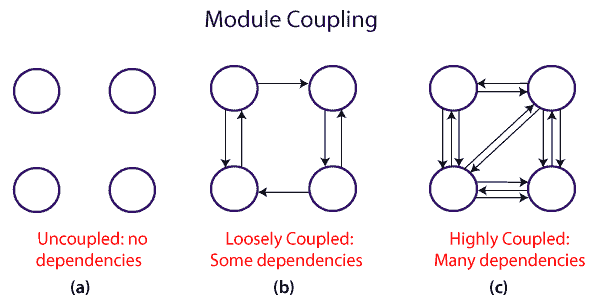
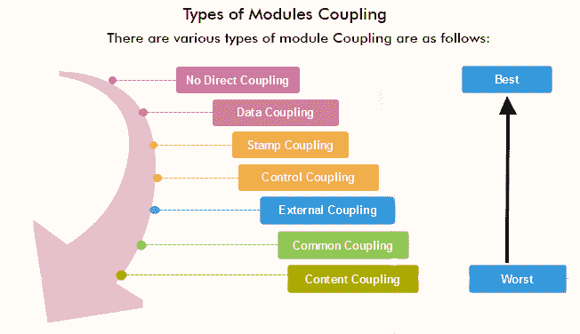
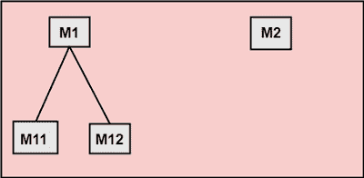
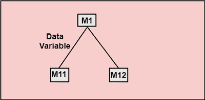
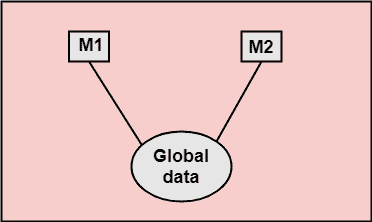
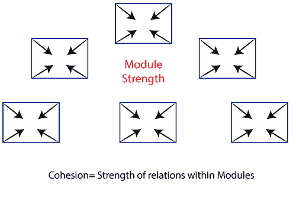
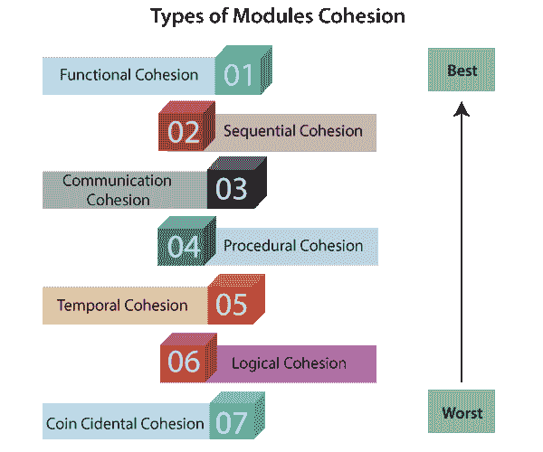

# 耦合与内聚

> 原文：<https://www.javatpoint.com/software-engineering-coupling-and-cohesion>

## 模块耦合

在软件工程中，耦合是软件模块之间相互依赖的程度。两个紧密耦合的模块相互依赖。然而，松散耦合的两个模块并不相互依赖。**未耦合的模块**在它们内部完全没有相互依赖性。

**各种耦合技术如图所示:**

耦合度低的设计才是好的设计。耦合是通过模块之间的关系数量来衡量的。也就是说，随着模块间调用次数的增加或共享数据量的增加，耦合性也会增加。因此，可以说高耦合的设计会有更多的误差。

### 模块耦合的类型

**1。无直接耦合:**M1 与 M2 无直接耦合。

在这种情况下，模块是不同模块的下属。因此，没有直接耦合。

**2。数据耦合:**当一个模块的数据传递到另一个模块时，这称为数据耦合。

**3。Stamp Coupling:** 如果两个模块使用复合数据项(如结构、对象等)进行通信，则它们是 Stamp Coupling。当模块将非全局数据结构或整个结构传递给另一个模块时，它们被称为是戳耦合的。例如，将 C 语言的结构变量或 C++语言的对象传递给模块。

**4。控制耦合:**如果一个模块的数据用于指导另一个模块的指令执行结构，则两个模块之间存在控制耦合。

**5。外部耦合:**当两个模块共享外部强加的数据格式、通信协议或设备接口时，就会出现外部耦合。这与外部工具和设备的通信有关。

**6。公共耦合:**如果两个模块通过一些全局数据项共享信息，则它们是公共耦合的。

**7。内容耦合:**如果两个模块共享代码，则它们之间存在内容耦合，例如，从一个模块到另一个模块的分支。

* * *

## 模块内聚力

在计算机编程中，内聚性定义了模块的元素属于一起的程度。因此，内聚性度量给定模块中各功能之间的关系强度。例如，在高度内聚的系统中，功能性是紧密相关的。

衔接是一种**序数**类型的测量，通常被描述为“高衔接”或“低衔接”

### 模块内聚的类型

1.  **功能内聚性:**功能内聚性是说如果一个模块的不同元素存在，协同实现单一功能。
2.  **顺序衔接:**如果一个模块的元素构成序列的组成部分，其中来自序列的一个组成部分的输出被输入到下一个组成部分，则该模块被称为具有顺序衔接。
3.  **通信内聚性:**如果模块的所有任务都引用或更新相同的数据结构，例如在数组或堆栈上定义的函数集，则模块被称为具有通信内聚性。
4.  **程序衔接:**如果一个模块的一组目的是一个程序的所有部分，其中必须执行特定的步骤序列来实现一个目标，例如解码消息的算法，则该模块被称为程序衔接。
5.  **时间内聚性:**当一个模块包含所有方法必须同时执行这一事实所关联的函数时，该模块被称为表现出时间内聚性。
6.  **逻辑内聚性:**如果一个模块的所有元素都执行类似的操作，则称该模块具有逻辑内聚性。例如错误处理、数据输入和数据输出等。
7.  **巧合的内聚性:**如果一个模块执行一组彼此关联非常松散的任务(如果有的话)，则称其具有巧合的内聚性。

* * *

## 区分耦合和内聚

| 耦合 | 内聚力 |
| 耦合也称为模块间绑定。 | 内聚也称为模块内绑定。 |
| 耦合显示了模块之间的关系。 | 内聚性显示了模块内的关系。 |
| 耦合显示了模块之间的相对**独立性**。 | 内聚性显示了模块的相对**功能**强度。 |
| 创建时，您应该以低耦合为目标，即模块之间的依赖性应该更小。 | 创建时，您应该以高内聚为目标，即内聚的组件/模块专注于单一功能(即一心一意)，很少与系统的其他模块交互。 |
| 在耦合中，模块链接到其他模块。 | 在内聚性中，模块集中在一件事情上。 |

* * *