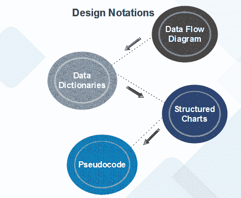
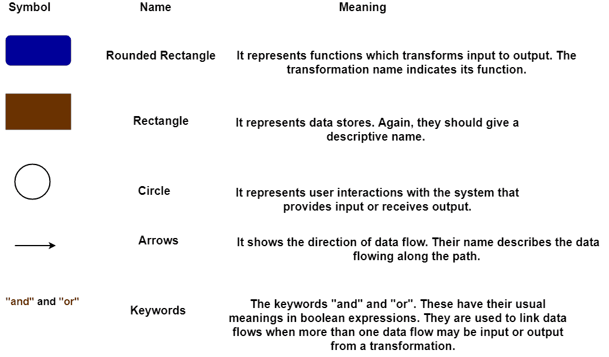
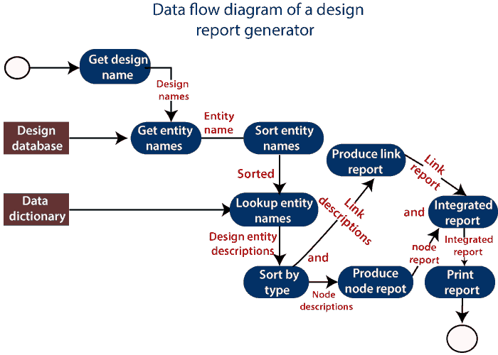
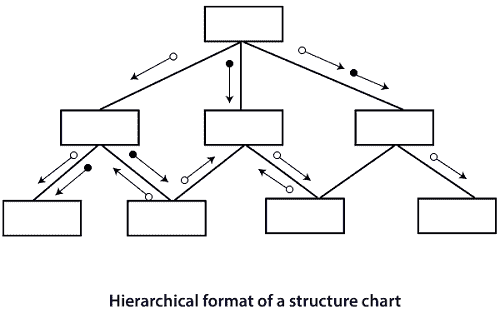
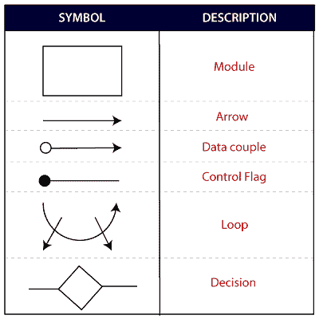

# 面向功能的设计

> 原文：<https://www.javatpoint.com/software-engineering-function-oriented-design>

面向功能的设计是一种软件设计方法，其中模型被分解成一组相互作用的单元或模块，其中每个单元或模块都有明确定义的功能。因此，该系统是从功能角度设计的。

## 设计符号

设计符号主要用于设计过程中，用于表示设计或设计决策。对于面向功能的设计，设计可以通过以下方式以图形或数学方式表示:

### 数据流图

数据流设计涉及设计一系列功能转换，将系统输入转换成所需的输出。该设计被描述为数据流图。这些图显示了数据是如何流经系统的，以及输出是如何通过一系列功能转换从输入中获得的。

数据流图是描述系统的一种有用而直观的方式。没有经过专门训练，它们通常是可以理解的，特别是如果控制信息被排除在外。它们显示端到端处理。这就是从数据进入系统到离开系统的处理流程。

数据流设计是几种设计方法不可分割的一部分，大多数 CASE 工具都支持数据流图的创建。不同的方式可能使用不同的图标来表示数据流图实体，但是它们的含义是相似的。

**使用的符号基于以下符号:**

报告生成器生成描述数据流图中所有命名实体的报告。用户输入由图表表示的设计名称。然后，报告生成器会找到数据流图中使用的所有名称。它查找数据字典并检索每个名字的信息。然后将其整理成报告，由系统输出。

### 数据字典

数据字典列出了系统的 DFD 模型中出现的所有数据元素。列出的数据项包含在系统的 DFD 模型中查看 DFD 的所有数据流和所有数据存储的内容。

数据字典列出了所有数据项的目标，以及所有复合数据元素在其组成数据项方面的定义。例如，数据字典条目可能包含数据*工资总额*由部分*定期工资*和*定期工资*组成。

**批发=定期+超额支付**

对于数据元素的最小单位，数据字典会列出它们的名称和类型。

数据字典在任何软件开发过程中都扮演着重要的角色，原因如下:

*   数据字典为所有相关信息提供标准语言，供在项目中工作的工程师使用。数据项的一致词汇是必不可少的，因为在大型项目中，项目的不同工程师倾向于使用不同的术语来指代相同的数据，这不必要地造成了混乱。
*   数据字典为分析师提供了一种方法，可以根据各种数据结构的组成元素来确定它们的定义。

### 结构化图表

它将一个系统划分成块盒。一种黑盒系统，其功能为用户所知，而无需了解内部设计。

结构化图表是一种图形表示，它显示:

*   系统划分成模块
*   组件模块的层次结构
*   处理模块之间的关系
*   模块之间的交互
*   模块之间传递的信息

**结构化图表中使用了以下符号:**

### 伪代码

伪代码符号可用于初步和详细设计阶段。使用伪代码，设计人员使用简短的英语语言阶段描述系统特征，这些阶段由诸如 If-Then-Else、While-Do 和 End 等关键字构成。

* * *