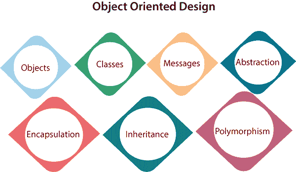

# 面向对象设计

> 原文：<https://www.javatpoint.com/software-engineering-object-oriented-design>

在面向对象的设计方法中，系统被视为对象(即实体)的集合。状态分布在对象中，每个对象处理其状态数据。例如，在图书馆自动化软件中，每个图书馆代表可能是一个单独的对象，其数据和功能对这些数据进行操作。为一个目的定义的任务不能引用或更改其他对象的数据。对象有代表其状态的内部数据。相似的对象创建一个类。换句话说，每个对象都是某个类的成员。类可以从超类继承特征。

**与物体设计相关的不同术语有:**

1.  **对象:**解决方案设计中涉及的所有实体都称为对象。例如，个人、银行、公司和用户被视为对象。每个实体都有一些与之相关联的属性，并且有一些对这些属性执行的方法。
2.  **类:**类是对一个对象的广义描述。对象是类的实例。一个类定义了对象可以具有的所有属性和表示对象功能的方法。
3.  **消息:**对象通过消息传递进行通信。消息由目标对象的完整性、请求操作的名称以及执行该功能所需的任何其他操作组成。消息通常被实现为过程或函数调用。
4.  **抽象**在面向对象设计中，使用抽象来处理复杂性。抽象是去除无关的东西，放大本质。
5.  **封装:**封装也叫信息隐藏概念。数据和操作被链接到一个单元。封装不仅将对象的基本信息捆绑在一起，而且还限制了从外部世界对数据和方法的访问。
6.  **继承:** OOD 允许类似的类以分层的方式堆叠起来，其中较低的类或子类可以从它们的直接超类中导入、实现和重用允许的变量和函数。OOD 的这个属性叫做继承。这使得定义特定的类和从特定的类创建通用的类变得更加容易。
7.  **多态性:** OOD 语言提供了一种机制，其中执行相似任务但参数不同的方法可以被赋予相同的名称。这就是所谓的多态性，它允许单个接口为不同的类型执行功能。根据服务被调用的方式，代码的相应部分被执行。

* * *