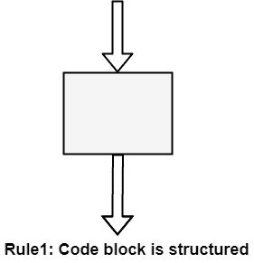
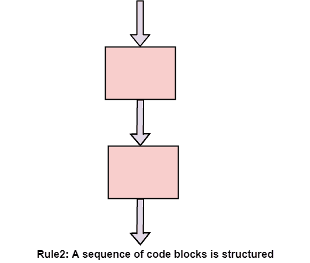
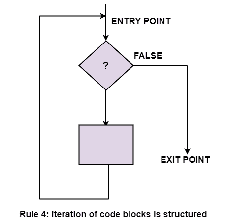
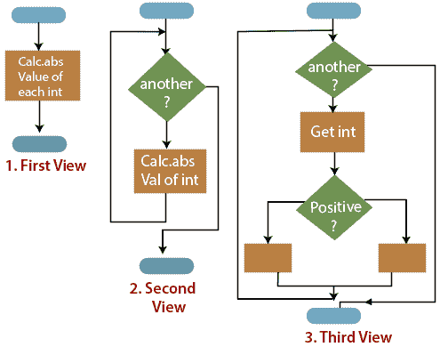

# 结构化程序设计

> 原文：<https://www.javatpoint.com/software-engineering-structured-programming>

在结构化编程中，我们将整个程序细分为小模块，以便程序变得易于理解。结构化编程的目的是使通过计算机程序的控制流线性化，以便执行顺序遵循代码编写的顺序。程序的动态结构不像程序的静态结构。这增强了程序的可读性、可测试性和可修改性。这种线性控制流可以通过将允许的应用程序构造集限制为单入口、单出口格式来管理。

## 我们为什么使用结构化编程？

我们使用结构化编程，因为它允许程序员容易地理解程序。如果一个程序由成千上万条指令组成，并且出现了一个错误，那么在整个程序中找到这个错误是很复杂的，但是在结构化编程中，我们可以很容易地检测到这个错误，然后去那个位置纠正它。这样可以节省很多时间。

**这些是结构化编程中的以下规则:**

### 结构化规则一:代码块

如果进入条件是正确的，但是退出条件是错误的，那么错误一定在块中。如果允许执行跳转到一个块，这是不正确的。错误可能在程序的任何地方。在这种情况下调试要困难得多。

**结构化编程规则 1:**一个代码块是结构化的，如图所示。在流程图条件下，构造了一个只有一个入口点和一个出口点的盒子。结构化编程是一种表明程序是正确的方法。

### 结构规则二:顺序

如果每个块的退出条件与下一个块的进入条件匹配，则块序列是正确的。执行在块的入口点进入每个块，并通过块的出口点离开。整个系列可以看作一个单独的区块，有一个入口点和一个出口点。

**结构化编程规则 2:**序列中两个或两个以上的代码块是结构化的，如图所示。

### 结构化规则三:交替

If-then-else 经常被称为交替(因为有替代选项)。在结构化编程中，每个选项都是一个代码块。如果交替是如流程图右侧所示组织的，那么有一个入口点(在顶部)和一个出口点(在底部)。应该对该结构进行编码，以便如果满足进入条件，则满足退出条件(就像代码块一样)。

**结构化编程规则 3:**两个代码块的交替是结构化的，如图所示。

交替方法的输入条件的一个例子是:寄存器$8 包含一个有符号整数。退出条件可能是:register $8 包含有符号数的绝对值。分支结构用于满足退出条件。

### 结构化规则 4:迭代

迭代(while-loop)被组织在右边。它还有一个入口点和一个出口点。入口点有必须满足的条件，出口点有需要满足的要求。代码的外部点没有跳转到表单中。

**结构化编程规则 4:**一个代码块的迭代是结构化的，如图所示。

### 结构化规则 5:嵌套结构

在流程图条件下，任何代码块都可以扩展到任何结构中。如果流程图中有一部分只有一个入口点和一个出口点，则可以将其总结为一个代码块。

**结构化编程规则 5:**具有单个入口点和单个出口点的结构(任何大小)相当于一个代码块。例如，我们正在设计一个程序来遍历有符号整数列表，计算每个整数的绝对值。我们可以 **(1)** 先把程序看成一个块，然后 **(2)** 在需要迭代的地方勾画，最后 **(3)** 放入循环体的细节，如图。

其他的控制结构是 case、do-to、do-while 和 for，它们是不需要的。然而，它们有时很方便，通常被视为结构化编程的一部分。在汇编语言中，它们几乎没有增加什么便利。

* * *