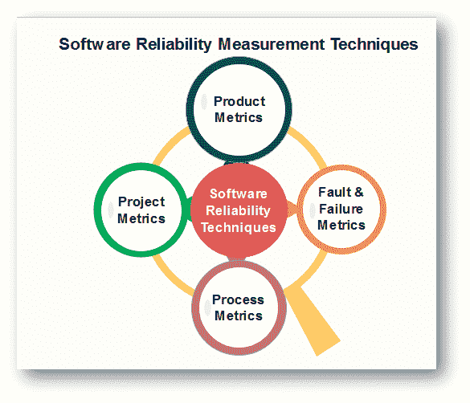

# 软件可靠性度量技术

> 原文：<https://www.javatpoint.com/software-engineering-software-reliability-measurement-techniques>

**可靠性度量**用于定量表示软件产品的可靠性。选择使用哪个参数取决于它所应用的系统类型&应用领域的要求。

测量软件可靠性是一个严重的问题，因为我们对软件的本质没有很好的理解。很难找到一种合适的方法来衡量软件可靠性以及与软件可靠性相关的大多数方面。甚至软件估计也没有统一的定义。如果我们不能直接测量可靠性，那么可以测量一些反映与可靠性相关的特征的东西。

**目前软件可靠性度量的方法可以分为四类:**

## 1.产品指标

产品度量是用于构建工件的度量，即需求规格文档、系统设计文档等。通过可用性、可靠性、可维护性和可移植性等属性的记录，这些指标有助于评估产品是否足够正确。在这些测量中，数据取自源代码的实际主体。

1.  软件规模被认为是复杂性、开发工作和可靠性的反映。代码行 **(LOC)** ，或以千计的 LOC**(KLOC)**，是测量软件规模的最初直观方法。 **LOC** 的基础是程序长度可以作为程序特性的预测因子，例如努力程度&维护的难易程度。它是程序功能复杂性的量度，并且独立于编程语言。
2.  功能点度量是一种基于输入、输出、主文件、查询和接口的计数来度量建议的软件开发的功能的技术。
3.  假设软件可靠性是被成功验证或测试的软件部分的函数，通过在软件产品上执行测试，测试覆盖度量确定故障和可靠性的大小。
4.  复杂性与软件可靠性直接相关，因此表示复杂性是必不可少的。面向复杂性的度量是一种通过将代码简化为图形表示来确定程序控制结构复杂性的方法。代表性的指标是麦凯布的复杂性指标。
5.  质量度量标准衡量软件产品开发的各个阶段的质量。一个重要的质量指标是**缺陷去除效率(DRE)** 。由于在整个开发过程中应用了不同的质量保证和控制活动，DRE 提供了一种质量度量。

## 2.项目管理度量

项目度量定义了项目特征和执行。如果程序员对项目有适当的管理，那么这有助于我们实现更好的产品。开发过程和在期望的质量目标内按时完成项目的能力之间存在关系。当开发人员使用不适当的方法时，成本会增加。通过使用更好的开发流程、风险管理流程、配置管理流程，可以实现更高的可靠性。

**这些指标是:**

*   软件开发人员数量
*   软件生命周期中的人员配置模式
*   成本和进度
*   生产力

## 3.过程度量

过程度量量化了软件开发过程及其环境的有用属性。当他们报告像周期时间和返工时间这样的特征时，他们会判断过程是否运行最佳。过程度量的目标是在过程的第一时间做正确的工作。产品质量是工艺的直接功能。因此，过程度量可以用来评估、监控和提高软件的可靠性和质量。过程度量描述了生产软件产品的过程的有效性和质量。

**例子有:**

*   过程中需要付出的努力
*   生产产品的时间
*   开发过程中缺陷消除的有效性
*   测试期间发现的缺陷数量
*   流程的成熟度

## 4.故障和故障度量

错误是程序中的一种缺陷，当程序员在特定条件下执行程序时出现错误并导致失败。这些指标用于确定无故障执行软件。

为了实现这一目标，需要收集、总结和分析测试过程中发现的大量故障以及用户在交付后报告的故障或其他问题。故障指标基于软件发布后发现的故障的客户信息。因此，收集的故障数据用于计算故障密度、**平均故障间隔时间(MTBF)** 或其他参数，以测量或预测软件可靠性。

* * *