# 基本执行时间模型

> 原文：<https://www.javatpoint.com/software-engineering-basic-execution-time-model>

这个模型是由穆萨(J.D. Musa)在 1979 年建立的，它是基于执行时间的。基本执行模型是最流行和普遍使用的可靠性增长模型，主要是因为:

*   它实用、简单、易懂。
*   它的参数显然与物理世界有关。
*   它可用于精确的可靠性预测。

基本执行模型最初使用执行时间来确定故障行为。执行时间可能会在以后转换为日历时间。

失效行为是**非齐次泊松过程**，这意味着相关的概率分布是泊松

特征随时间变化的过程。

相当于 **M-O 对数泊松执行时间模型**，均值函数不同。

在这种情况下，均值函数基于指数分布。

**基本执行模型中涉及的变量:**

**故障强度(λ):** 单位时间的故障次数。

**执行时间(τ):** 程序运行以来的时间。

**经历的平均故障(μ):** 在一个时间间隔内经历的平均故障。

在基本执行模型中，所经历的平均故障μ用执行时间(τ)表示为

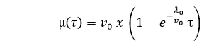

**其中**

**-λ 0 :** 代表执行开始时的初始失效强度。

**-v 0 :** 代表无限时间段内发生的故障总数；它对应于最终观察到的预期故障数量。

故障强度表示为执行时间的函数，由下式给出

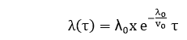

它是基于上面的公式。失效强度λ用μ表示为:

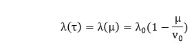

**其中**

**λ 0 :** 初始

**v 0 :** 如果一个程序执行了无限长的时间，所经历的失败次数。

**μ:** 给定时间段内经历的平均或预期故障次数。

**τ:** 执行时间。

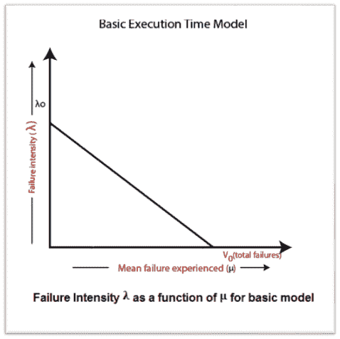
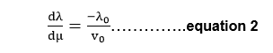
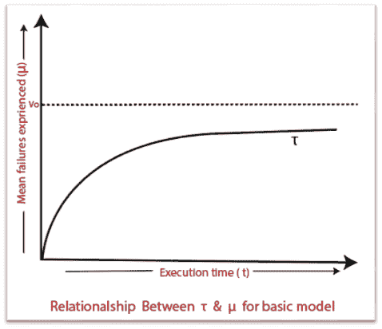

对于这种关系的推导，等式 1 可以写成:

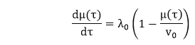

上述方程可由λ(τ)求解，结果为:

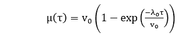

作为执行时间函数的故障强度如图 1 所示:

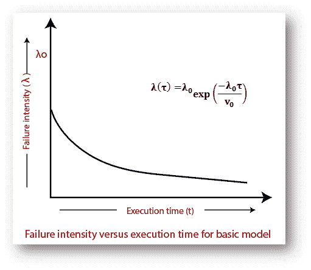

基于以上表达式，给定某个故障强度目标，可以计算预期故障数∏λ和达到该目标所需的额外执行时间∏τ。

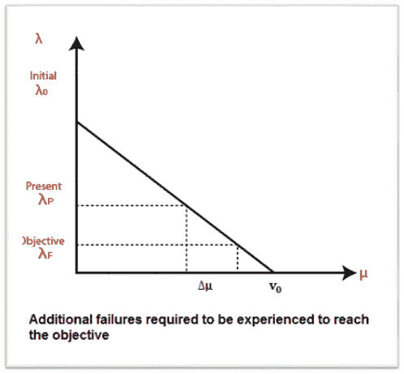
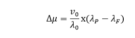

**其中**

**λ 0 :** 初始故障强度

**λ P :** 当前故障强度

**λ F :** 强度目标失败

**∏μ:**达到故障强度目标所需经历的额外故障的预期数量。

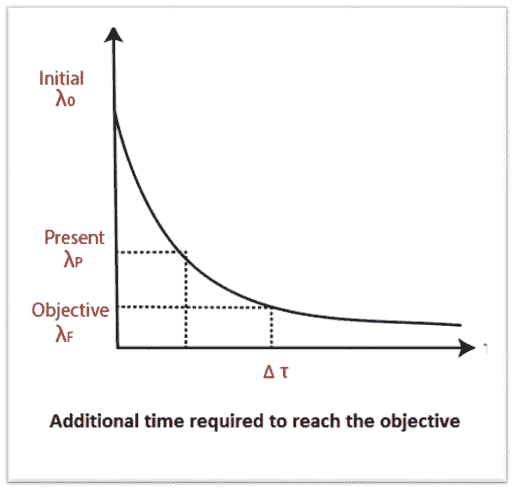

这可以用数学形式推导出来:

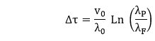

**示例:**假设一个程序在无限时间内会经历 200 次失败。它现在已经经历了 100 次。初始故障强度为 20 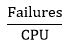小时。确定当前故障强度。

1.  求每次故障的故障强度减量。
2.  计算 20 小时和 100 小时后经历的故障和故障强度。执行死刑。
3.  计算达到 5 次故障/CPU 小时的故障强度目标所需的额外故障和额外执行时间。

使用上述计算的基本执行时间模型。

**解决方案:**

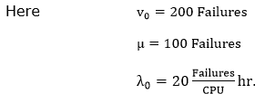

**(1)电流故障强度:**

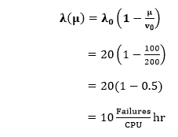

**(2)每次故障的故障强度减量可计算为:**

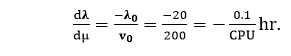

**(3)(a)20 个 CPU 小时后出现故障&故障强度**

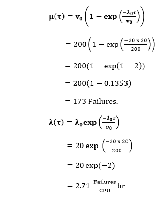

**(b)100 CPU 小时后出现故障&故障强度**

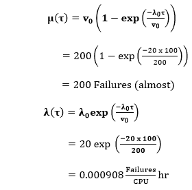

**4。达到 5 小时**的故障强度目标所需的额外故障(≈μ)

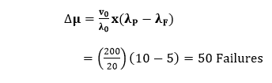

**达到 5 小时**故障强度目标所需的额外执行时间

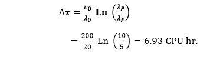

* * *