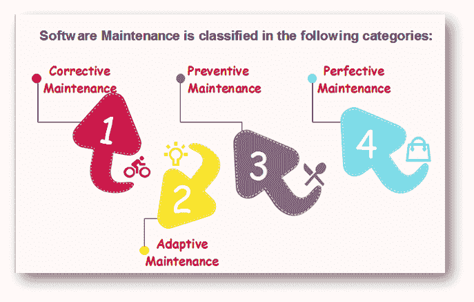

# 软件维护

> 原文：<https://www.javatpoint.com/software-engineering-software-maintenance>

软件维护是软件开发生命周期的一部分。它的主要目标是在交付后修改和更新软件应用程序，以纠正错误并提高性能。软件是现实世界的模型。当现实世界发生变化时，软件需要尽可能地进行修改。

软件维护是一项包容性的活动，包括错误纠正、功能增强、过时功能删除和优化。

## 维护需求

以下情况需要软件维护:-

*   改正错误
*   用户需求随时间的变化
*   不断变化的硬件/软件要求
*   为了提高系统效率
*   优化代码以更快地运行
*   要修改组件
*   以减少任何不必要的副作用。

因此，需要进行维护，以确保系统继续满足用户需求。

## 软件维护的类型

### 1.故障检修

纠正性维护旨在纠正任何剩余的错误，无论这些错误在哪里会导致规格、设计、编码、测试和文档等。

### 2.适应性维护

它包括修改软件以适应不断变化的环境中的变化。

### 3.预防性维修

这是我们防止我们的系统过时的过程。它涉及到再造&逆向工程的概念，即利用新技术对一个有旧技术的旧系统进行再造。这种维护可以防止系统崩溃。

### 4.完美的维护

它定义了提高处理效率或性能或限制软件以增强可变性。这可能包括现有系统功能的增强、计算效率的提高等。

* * *