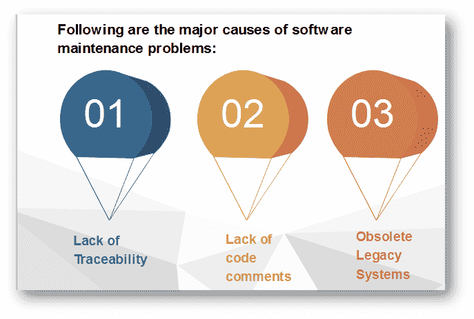
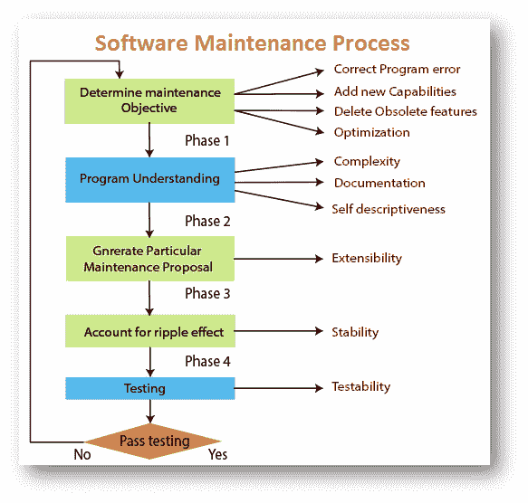

# 软件维护问题的原因

> 原文：<https://www.javatpoint.com/software-engineering-causes-of-software-maintenance-problems>

**缺乏可追溯性**

*   代码很少能追溯到需求和设计规范。
*   这使得程序员很难发现和纠正影响客户操作的关键缺陷。
*   像侦探一样，程序员仔细检查程序寻找线索。
*   生命周期文档并不总是作为开发项目的一部分而产生的。

**缺少代码注释**

*   大多数软件系统代码缺乏足够的注释。在某些情况下，较少的评论可能没有帮助。

**过时的遗留系统**

*   在世界上大多数国家，为国家关键行业提供支柱的遗留系统，例如电信、医疗、运输公用事业服务，在设计时并没有考虑到维护。
*   预计它们不会持续 25 年或更长时间！
*   因此，支持这些系统的代码缺乏对需求的可追溯性、对设计和编程标准的遵从性，并且经常包括死的、额外的和未注释的代码，所有这些都使得维护任务近乎不可能。

## 软件维护过程

**程序理解**

第一步包括分析程序来理解。

**产生特定的维护问题**

第二阶段包括创建一个特定的维护提案，以实现维护目标。

**涟漪效应**

第三步包括考虑程序修改的所有连锁反应。

**修改程序测试**

第四步包括测试修改后的程序，以确保修改后的应用程序至少具有与以前相同的可靠性水平。

**维修性**

这四个步骤及其相关的软件质量属性对维护过程至关重要。所有这些方法必须结合起来才能形成可维护性。

* * *