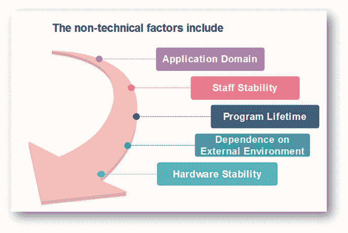
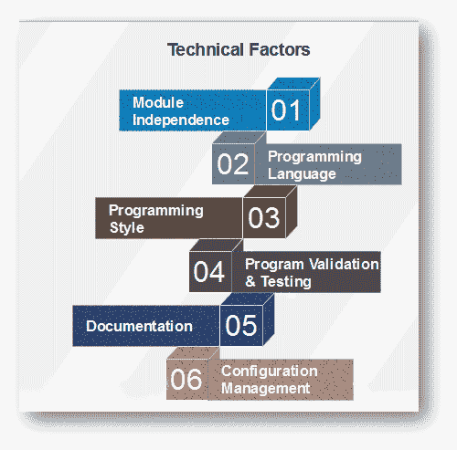

# 软件维护成本因素

> 原文：<https://www.javatpoint.com/software-engineering-software-maintenance-cost-factors>

软件维护涉及两种类型的成本因素。

这些是

*   非技术因素
*   技术因素

## 非技术因素

**1。应用领域**

*   如果程序的应用被定义并被很好地理解，系统需求可能是确定的，并且由于需求的变化而导致的维护被最小化。
*   如果表单是全新的，那么随着用户对系统的体验增加，初始条件可能会频繁修改。

**2。员工稳定性**

*   对于程序的原始作者来说，理解和更改应用程序很简单，而不是其他人必须通过研究报告和代码列表来理解程序。
*   如果一个系统的实现也维护那个系统，维护成本就会降低。
*   实际上，编程职业的特点是人们定期更换工作。一个用户在应用程序的整个使用寿命中开发和维护它是不寻常的。

**3。程序寿命**

*   当程序变得过时，或者它们原来的硬件被替换，转换成本超过重写成本时，程序就会变得过时。

**4。对外部环境的依赖**

*   如果一个应用程序依赖于它的外部环境，它必须随着气候的变化而修改。
*   例如:
*   税务系统的变化可能需要修改工资、会计和库存控制程序。
*   税收变化几乎频繁，这些程序的维护成本与这些变化的频率相关。
*   数学应用中使用的程序通常不依赖于人类改变程序所基于的假设。

**5。硬件稳定性**

*   如果应用程序被设计为在特定的硬件配置上运行，并且该配置在程序的生命周期内没有变化，则不会因硬件变化而产生维护成本。
*   硬件的发展如此之快，以至于这种情况很少见。
*   必须改变应用程序，以使用新的硬件来替换过时的设备。

## 技术因素

技术因素包括以下内容:

**模块独立性**

应该可以改变系统的一个程序单元，而不影响任何其他单元。

**编程语言**

用高级编程语言编写的程序通常比用低级语言编写的程序更容易理解。

**编程风格**

编写程序的方法有助于程序的可理解性，从而便于修改。

**程序验证和测试**

*   一般来说，花在设计验证和程序测试上的时间和精力越多，程序中的错误就越少，因此，错误纠正导致的维护成本就越低。
*   由于错误纠正而产生的维护成本取决于要修复的故障类型。
*   纠正编码错误通常相对便宜，设计错误更贵，因为它们可能包括重写一个或多个程序单元。
*   软件需求中的错误通常是最昂贵的，因为通常涉及激烈的设计。

**文件**

*   如果一个程序有清晰、完整而简洁的文档支持，那么理解应用程序的功能就可以直接关联起来。
*   报告良好的系统的程序维护成本往往低于文件不充分或不完整的系统。

**配置管理技术**

*   维护的基本成本之一是跟踪所有系统文档，并确保这些文档保持一致。
*   有效的配置管理可以帮助控制这些成本。

* * *